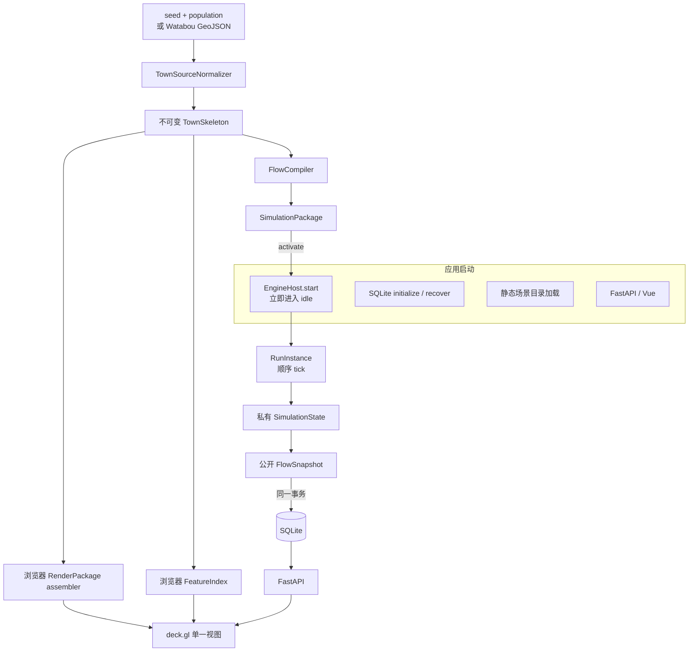

# 城镇生成、流量仿真与分层渲染架构

> 状态：架构方向已批准，书面规格待复核
>
> 日期：2026-08-02
>
> 适用仓库：`world_simulation_2D`

## 1. 结论

当前模块化单体、确定性 tick、SQLite 回放和统一时间轴继续保留。下一阶段只调整三个会限制城镇扩展的边界：

1. 使用可复现的城镇场景包替换只有地点圆点和连接线的图结构。
2. 使用 deck.gl 单一 WebGL 视图替换 Leaflet 与独立 Canvas 的双坐标渲染。
3. 将引擎内部旅行队列与公开回放快照分开，避免每个 tick 持久化完整队列。

不替换 FastAPI、Vue、SQLite 和自研固定步长引擎；不引入微服务、消息队列、SUMO、Mesa、SimPy、MapLibre 或 PixiJS。

## 2. 目标与非目标

### 2.1 1.0 必须完成

- 用户可输入 `generation_seed` 和 `population`，也可随机生成 seed。
- 相同生成器版本、seed 和人口必须产生相同场景 checksum。
- 城镇具有边界、城墙、城门、街区、建筑、道路和功能地标，不再表现为节点图。
- 建筑功能至少区分住宅、市场、工坊、仓储、宗教、行政、军事和城门。
- 人流使用点，车流使用有方向的图标；二者具有独立图例和显隐控制。
- 地点密度使用热力图；道路流量使用贴合街道的发光热度带。
- 缩放和平移期间，建筑、道路、热力和移动标记共享同一相机，不发生图层漂移。
- 仿真宿主随应用启动进入 idle，不等待场景生成或流量数据计算。
- 场景几何编译与流量编译是同一不可变输入的兄弟分支，渲染准备不阻塞 tick。
- 每个已提交 tick 可从 SQLite 精确恢复同一聚合画面。

### 2.2 仍然不做

- 不把普通居民和车辆逐个持久化为实体。
- 不实现真实车道、跟车、红绿灯、碰撞或排放模型。
- 不实现连续世界到城镇的几何 LOD；3.0 仍采用场景切换和数据连续。
- 不把 Watabou GPL 源码复制进仓库，也不在运行时依赖其网站。
- 不增加通用插件系统、任务队列、事件总线或只有一个实现的工厂。
- 不为未来崩溃续跑保存内部队列 checkpoint；当前重启语义仍是将活动运行标记为 failed。

## 3. 方案选择

### 3.1 渲染器

| 方案 | 结论 | 原因 |
| --- | --- | --- |
| Leaflet + Canvas | 退出主渲染路径 | 静态地图和动态粒子需要手工同步两个坐标变换，复杂城镇会继续放大漂移和维护成本 |
| PixiJS | 保留为失败回退，不实施 | 适合游戏精灵，但多边形、路径、热力、拾取和数据更新语义需要自行搭建 |
| deck.gl `OrthographicView` | 采用 | 原生支持非地理 XY 顶视图，并提供 Polygon、Path、Icon、Scatterplot、Text 和 Heatmap 图层 |

deck.gl 以 standalone `Deck` 类接入 Vue，不安装 React、MapLibre 或完整 `deck.gl` 聚合包。1.0 只安装：

```text
@deck.gl/core
@deck.gl/layers
```

`@deck.gl/geo-layers` 只有 3.0 世界瓦片或经验证需要 `TripsLayer` 时才增加。

### 3.2 仿真框架

- SimPy 官方说明固定步长、弱共享资源交互的模拟可能属于过度使用，因此不替换当前引擎。
- Mesa 面向 Agent-Based Modeling；2.0 只有少量英雄、领袖和商队，不需要把整个模型迁入 Agent 框架。
- SUMO 面向车道和逐车微观/中观交通；当前模型是聚合人口和车辆流，不应被真实交通规则绑架。

当前模型明确定义为：**固定步长、确定性、聚合/中观队列模型**。该定义写入 README，避免把可视化车辆误解为逐车仿真结果。

### 3.3 通信与存储

- 命令继续使用 HTTP；1 Hz 最新快照继续轮询。
- SQLite 继续使用 WAL、单写入者和事务提交。
- 不实现 WebSocket。并发观察者增加或 tick 频率高于 1 Hz 后，优先增加单向 SSE。
- 每个 tick 保存完整的公开 `FlowSnapshot`，不做事件溯源或差分快照。

## 4. 规范运行拓扑



### 4.1 启动顺序

Python 最低版本暂时保持 3.10，因此使用 `asyncio.create_task`/`gather`，不为 `TaskGroup` 单独提高版本要求：

```text
lifespan start
  1. 创建 EngineHost，立即 start()；scheduler 在无 run 时等待 wake_event
  2. 并发调度 storage.initialize/recover 与 ScenarioCatalog.load_all
  3. 两项成功后将依赖绑定到 API
  4. readiness=true，开始接收请求
```

`EngineHost` 是现有 `RunController` 调度职责的重命名和收敛，不新增一层转发对象。它只维护一个活动 `RunInstance`。

启动并发主要消除不必要的依赖关系，不承诺 CPU 任务通过 asyncio 获得并行加速。城镇生成经 profile 证明阻塞事件循环后，才把纯函数放入标准库进程池。

### 4.2 必要屏障

只有以下屏障合法：

1. `TownSkeleton` 完成前，两个编译分支不能读取半成品。
2. `SimulationPackage` 校验成功且 tick 0 事务提交后，`RunInstance` 才能推进 tick 1。
3. tick T 的数据库事务提交后，API 才能把 T 发布为 latest。

`RenderPackage` 只在浏览器从完整 skeleton 派生，不参与 run 创建事务。它未完成、图标加载失败或热力图初始化失败都不能阻止后端仿真。前端应显示静态加载态并在渲染资源就绪后补画。

## 5. 场景数据边界

### 5.1 两种 seed

| 字段 | 作用 | 是否进入场景 checksum |
| --- | --- | --- |
| `generation_seed` | 固定城墙、街道、建筑和功能分布 | 是 |
| `simulation_seed` | 固定每个 tick 的需求变化 | 否，写入 run |

同一城镇可使用不同 `simulation_seed` 创建多次运行。UI 必须分别显示两者，不能用一个模糊的“随机种子”字段承担两个含义。`source_metadata` 只保存 source kind、版本、seed、population 和可选 source checksum；不得混入 draft ID、创建时间、绝对路径或请求 ID。

### 5.2 `TownSkeleton`

生成器和 importer 都输出同一规范结构：

```text
TownSkeleton
  schema_version: 2
  scenario_id: string
  name: string
  generation_seed: integer
  generator_version: "radial-v1" | "watabou-geojson-v1"
  requested_population: integer
  initial_vehicle_count: integer
  coordinate_system: "local_xy"
  coordinate_unit: "meter"
  axis_orientation: "x_right_y_up"
  bounds: [min_x, min_y, max_x, max_y]
  boundary: Coordinate[]
  districts: District[]
  buildings: Building[]
  junctions: Junction[]
  streets: StreetSegment[]
  landmarks: Landmark[]
```

关键子类型：

```text
District
  id, kind, polygon

Building
  id, district_id, kind, polygon, anchor

Junction
  id, position, kind(normal|gate|plaza)

StreetSegment
  id, from_junction_id, to_junction_id, path, width, kind

Landmark
  id, building_id|null, kind, name, position
```

生成场景的 `scenario_id` 固定为
`town-` 加 `sha256(generator_version:generation_seed:population)` 的前 16 个十六进制字符；显示名称不参与 ID。其余 ID 由 `kind + generation_seed + ordinal` 派生，不能使用 UUID。所有坐标在进入 canonical JSON 前四舍五入到 6 位小数；多边形不重复保存闭合终点，渲染和校验统一视为隐式闭合。

### 5.3 `SimulationPackage`

流量图保持稀疏，不把每栋建筑变成引擎节点：

```text
SimulationPackage
  tick_seconds: 1
  flow_types: FlowType[]
  locations: FlowLocation[]
  connections: FlowConnection[]
  bindings: FlowBindings
  street_graph: StreetGraph

FlowLocation
  id, name, kind, position, initial_counts

FlowConnection
  id, from_location_id, to_location_id
  street_segment_ids[]
  street_directions[]
  path[]
  travel_time_ticks: flow_type -> integer
  capacity_per_tick
  demand_per_tick

FlowBindings
  location_feature_ids: location_id -> [building/landmark ids]
  connection_street_ids: connection_id -> [street segment ids]

StreetGraph
  junctions: TownJunction[]
  edges: TownStreet[]
```

`StreetGraph` 是引擎输入而不只是绘图数据：每个生成的 `TownJunction` 一对一成为节点，每个 `TownStreet` 一对一成为边。`radial-v1` 同时为每个生成街区建立一个出行起终点 FlowLocation，并为城门、广场和唯一功能地标保留独立地点。`FlowCompiler` 使用标准库 `heapq` 在 StreetGraph 上生成稳定最短路，邻接边按 ID 排序解决等长路径的不确定性。

连边步骤固定为：

1. 将每个 FlowLocation 绑定到最近 junction，距离相同时取 junction ID 较小者。
2. 对 FlowLocation 两两计算最短街道距离。
3. 用稳定 Kruskal 最小生成树保证整个 FlowGraph 连通。
4. 对尚未进入任何路线的物理街道补充一条固定起终点的备用路线。
5. 每个无向结果输出两个有向 FlowConnection，反向连接反转 segment IDs 和 path。

每个连接按实际 path 长度和最窄 street width 生成默认参数：

```text
travel_time_ticks.pedestrian = clamp(ceil(path_length_m / 1.4), 1, 3600)
travel_time_ticks.vehicle    = clamp(ceil(path_length_m / 4.0), 1, 3600)

capacity_per_tick.pedestrian = max(1, floor(min_street_width_m * 1.5))
capacity_per_tick.vehicle    = max(1, floor(min_street_width_m / 2.5))

demand_per_tick.<type>.min = 0
demand_per_tick.<type>.max = max(1, floor(capacity_per_tick.<type> * 0.6))
```

这些值是可复现的演示参数，不声称是交通工程校准结果。后续校准只调整编译常量，不修改引擎算法或场景几何。

### 5.4 `RenderPackage`

`RenderPackage` 是浏览器内的派生读模型，只重排 `TownSkeleton` 为 deck.gl 易读结构，不复制流量状态，也不写入 SQLite：

```text
RenderPackage
  bounds
  boundary
  district_features[]
  building_features[]
  street_features[]
  wall_features[]
  landmark_features[]
```

1.0 的 API 仍发送包含 skeleton 的普通 JSON；前端在场景切换时组装上述数组。单场景响应超过 5 MiB 或解析超过 100 ms 后，才评估 flat GeoJSON、typed array 或分块流式传输。

### 5.5 完整运行场景包

```text
RunScenarioBundle
  schema_version: 2
  source_metadata
  town_skeleton
  simulation_package
  checksum
```

`checksum` 是除 checksum 字段自身以外其余字段 canonical JSON 的 SHA-256。创建运行时把完整 canonical JSON 写入 `runs.scenario_bundle_json`。生成草稿只驻留内存，不新增 `scenarios` 表；服务重启后草稿消失，但已创建 run 的回放不受影响。任何版本的前端都只能从 stored skeleton 重建表现层，不能要求历史 run 保存特定 renderer 的缓存。

内存草稿在 flow 编译期间保存最小状态：

```text
ScenarioDraft
  draft_id
  town_skeleton
  skeleton_checksum
  compile_status: compiling | ready | failed
  simulation_package: SimulationPackage | null
  bundle_checksum: string | null
  error_code: string | null
```

生成请求在线程中完成 skeleton 后立即创建 draft，并用有强引用的后台 task 启动 FlowCompiler。浏览器此时已经可以从 skeleton 组装 RenderPackage；只有创建 run 需要等待 `compile_status=ready`。

## 6. 可复现城镇生成器 `radial-v1`

第一版生成器不实现任意平面多边形布尔运算。它使用可测试的放射环形布局，目标是生成有范围、有街区和建筑的城镇，而不是复刻 Watabou 的具体算法。

### 6.1 输入校验

```text
generation_seed: 0 .. 2^53-1
population: 100 .. 100000
name: 1 .. 64 chars，可选；省略时固定为 `Town-{generation_seed}`
```

未提供 seed 时使用 `secrets.randbits(53)`，响应必须返回实际值。生成过程的每次伪随机采样都使用：

```text
stable_float(seed, namespace, ordinal)
  = sha256("radial-v1:seed:namespace:ordinal") 前 8 字节 / 2^64
```

禁止依赖全局 `random` 状态或遍历无序集合。

### 6.2 固定生成步骤

1. 根据人口计算目标建筑数：`clamp(ceil(population / 20), 40, 2000)`；人口只表示 `pedestrian` 总数。
2. 计算 `ring_count=clamp(ceil(sqrt(target_buildings / 8)), 2, 8)`；再计算 `sector_count=clamp(ceil(target_buildings / (ring_count * 3)), 8, 32)`。每个街区依稳定顺序放置最多 8 栋建筑，达到 target 后停止。
3. 计算 `town_radius_m=max(180, sqrt(target_buildings) * 20)`，用 16 个带 +/-8% 稳定径向扰动的点生成城镇边界；相邻点极角严格递增。
4. 在四个主方向附近选择边界顶点作为城门，并生成城墙折线。
5. 从城门到中心生成主路；在半径 `0.18 + 0.82*i/ring_count` 处生成环路；用扇区边界生成次级道路。主路宽 8 米，环路宽 6 米，次级道路宽 4 米。
6. 相邻环和相邻扇区之间形成四边形街区；以双线性插值向内收缩得到建筑地块。
7. 在每个地块放置 1 到 8 个建筑 footprint，直到达到目标建筑数。
8. 按距离中心、城门和外围的规则分配功能；同分时使用稳定摘要决定。
9. 在不可变 `TownSkeleton` 发布后，`FlowCompiler` 先把全部 junction/street 编译为可运行 StreetGraph，再从城门、中心、区中心和地标构建固定起终点的出行计划并沿图求路。
10. `FlowCompiler` 用最大余数法把 `population` 精确分配到 flow locations；`pedestrian` 总数必须完全相等。
11. `FlowCompiler` 完成后规范化数组顺序，组装完整 bundle 和 checksum；浏览器独立从 skeleton 组装 RenderPackage。

步骤 1 到 8 只属于生成器；步骤 9 到 11 属于读取不可变 skeleton 的 FlowCompiler。浏览器 RenderPackage assembler 是另一个只读分支；三者不得通过共享可变 list 交换中间状态。

街区和建筑切分不再留给实现者选择：每个 `(ring_index, sector_index)` 四边形就是一个 District。令 `block_count=ring_count*sector_count`，使用 `divmod(target_buildings, block_count)` 得到每个街区的基础 lot 数，余数按 district ID 顺序各加一，因此建筑总数严格等于 target。每个 district 先沿参数空间较长方向等分 lot，lot 四边向街区中心收缩 12% 留出道路退距，再向自身中心收缩 15% 得到 building footprint。退化或自交 footprint 使整个生成失败，不能静默跳过。

四个 gate 位于最接近 0、90、180、270 度的边界边中点。城墙沿 boundary 绘制，但在每个 gate 中心两侧各截去 4 米，形成 8 米真实缺口。每种非住宅功能只选择一个最靠近相应目标区域的代表建筑成为 Landmark；其余同类建筑仍保留功能 kind，但不增加 FlowLocation。

`vehicle` 表示马车、货车等聚合载具，不计入居民人口。`radial-v1` 使用
`clamp(round(population / 80), 5, 1000)` 生成初始载具总数，再以同一最大余数法分配；以后只有出现明确产品需求时才增加第二个人工数量输入。

功能分配默认规则：

- 中心最近建筑：行政或广场附属建筑。
- 中心第一圈：市场、商会、宗教。
- 城门和城墙附近：军事、仓储。
- 外圈且靠主路：工坊、马厩。
- 其余：住宅。

### 6.3 Watabou 导入

Watabou GeoJSON 是另一种 source normalizer，不是第二套运行时模型：

```text
GeoJSON bytes
  -> JSON 语法与 feature 类型校验
  -> 坐标归一化到 local_xy / x_right_y_up
  -> feature 角色映射
  -> 缺失 street topology 时从相交端点建立 junction
  -> TownSkeleton
  -> 与 radial-v1 相同的 compiler
```

导入器保存 source checksum、导出格式和 importer version，不保存外部 URL。无法识别的 feature 进入 import report，不允许静默变成流量节点。

## 7. 引擎状态与快照

### 7.1 私有 `SimulationState`

```text
SimulationState
  tick
  location_counts
  transit_queues
  connection_activity
  totals
```

`transit_queues` 只在引擎内存中存在。第一版可继续使用 list；迁移完成后用 `collections.deque` 或环形游标消除 `pop(0)`，二者均为标准库实现。

### 7.2 公开 `FlowSnapshot` v2

```python
class ConnectionSnapshot(StrictModel):
    departed: int = Field(ge=0)
    arrived: int = Field(ge=0)
    in_transit: int = Field(ge=0)

class FlowSnapshot(StrictModel):
    schema_version: Literal[2] = 2
    tick: int = Field(ge=0)
    location_counts: dict[str, dict[str, int]]
    connections: dict[str, dict[str, ConnectionSnapshot]]
    totals: dict[str, int]
```

`FlowSnapshot` 不包含 `transit_buckets`。对每种 flow type 必须满足：

```text
sum(location_counts) + sum(connections.in_transit) == totals
```

视觉标记是按 `in_transit` 抽样得到的稳定 slots，不声称对应真实居民或真实车辆。历史回放使用 tick、slot 和 connection ID 生成相同视觉相位。

### 7.3 单 tick 提交流程

```text
previous SimulationState
  -> engine.step() 得到 next SimulationState
  -> project_snapshot(next)
  -> 校验内部状态和公开快照
  -> SQLite 事务插入 snapshot + guarded current_tick update
  -> commit 成功
  -> EngineHost 替换内存 state
  -> API 后续查询可见 latest
```

任何一步失败都保留最后提交状态。引擎不直接调用 API 或渲染器。

### 7.4 旧回放迁移

数据库表结构暂时不变，`state_json.schema_version` 决定解析器。开发数据库中的 v1 快照通过只读适配器转换为 v2 响应：

```text
v1 transit_buckets -> sum -> v2 in_transit
v1 connection_activity -> v2 departed/arrived
```

旧场景包同时经过 `LegacyRenderAdapter`：v1 location 转成最小地标，v1 connection
转成 street feature。旧回放不会凭空获得建筑，但仍能在新 deck.gl 视图中读取。

新运行只写 v2。两个适配器都有固定 fixture 测试；不原地重写用户已有数据库。

## 8. EngineHost

### 8.1 状态

```text
EngineHost
  scheduler_task
  active_run: RunInstance | None
  lock
  wake_event
  shutting_down
  ready

RunInstance
  run_record
  scenario_bundle
  simulation_package
  state: SimulationState
```

Host 状态为 `booting | idle | running | stopping | stopped`。run 状态继续使用 `running | paused | ended | failed`，两者不能混为一个枚举。

### 8.2 激活规则

`activate(bundle, simulation_seed)` 在同一把锁内完成：

1. 验证 host 为 idle 且数据库没有活动 run。
2. 校验 bundle checksum 和 `SimulationPackage` 引用。
3. 创建内部 tick 0 状态和公开 tick 0 快照。
4. 一个事务创建 run 并写入 tick 0。
5. commit 后设置 `active_run`，host 进入 running 并唤醒 scheduler。

生成城镇、导入 GeoJSON 和加载前端资产都不在该锁内执行。

### 8.3 健康检查

`GET /api/health` 返回：

```json
{
  "status": "ok",
  "engine_host": "idle",
  "storage": "ready",
  "catalog": "ready"
}
```

任一必要依赖未就绪时 HTTP 状态为 503。渲染资源不属于后端 health。

## 9. HTTP 契约变化

### 9.1 生成草稿

```http
POST /api/scenario-drafts
Content-Type: application/json

{"generation_seed":8815907750467,"population":11499,"name":"Alimontalle"}
```

该请求在 skeleton 完成后返回 202，不等待 FlowCompiler：

```text
draft_id
generation_seed
skeleton_checksum
compile_status: "compiling"
town_skeleton
```

前端立即显示城镇，同时递归轮询：

```http
GET /api/scenario-drafts/{draft_id}
```

ready 响应增加 `simulation_package` 和最终 `bundle_checksum`；failed 响应包含稳定 error code。轮询不使用 `setInterval`，上一次请求完成后 250 ms 再发下一次。

服务端以内存字典保存 `draft_id -> ScenarioDraft` 和编译 task 的强引用。容量固定为最近 8 个草稿：只移除已 ready/failed 的最旧项；8 个都在 compiling 时返回 429 `draft_capacity_reached`。run 创建后已经复制完整 bundle，不再依赖 draft 生命周期。

### 9.2 创建运行

```http
POST /api/runs

{"draft_id":"...","simulation_seed":7}
```

内置静态场景继续兼容：

```http
POST /api/runs

{"scenario_id":"demo-city","simulation_seed":7}
```

请求必须二选一提供 `draft_id` 或 `scenario_id`。draft 仍在 compiling 时返回 409 `draft_not_ready`，failed 时返回 422 `scenario_compile_failed`。响应继续包含 run、完整 stored bundle 和 tick 0。

### 9.3 其余接口

pause/resume/end/set_rate、运行列表、运行详情和按 tick 查询保持路径不变。快照响应升级为 v2，旧数据由后端适配，不让版本分支散落到 Vue 组件。

## 10. deck.gl 渲染规范

### 10.1 单一视图

`CityMap.vue` 只创建一个 `Deck` 实例：

```text
views = OrthographicView({id: "town", controller: true, flipY: false})
coordinateSystem = CARTESIAN
```

场景 bounds 计算初始 target、zoom、minZoom 和 maxZoom。所有数据保留 `[x,y]`，不交换为纬经度，不再调用 Leaflet projection。

### 10.2 固定图层顺序

```text
01 district-fill       PolygonLayer
02 boundary-wall       PathLayer
03 road-base           PathLayer
04 road-vehicle-heat   PathLayer
05 building-fill       PolygonLayer
06 street-heat         PathLayer
07 landmark-symbols    PolygonLayer
08 pedestrian-markers  ScatterplotLayer
09 vehicle-markers     PolygonLayer
10 labels              TextLayer
11 selection           PolygonLayer / PathLayer
```

道路热度不使用 KDE 热斑。引擎依据 route queue 的剩余 tick、物理边长度和 `street_directions`，把每批在途流量投影到唯一 StreetGraph 边，并在公开快照中输出每条街的 `in_transit`、`entered/exited` 和正反方向存量。前端直接按同一 snapshot 内的绝对 `in_transit` 归一化颜色和宽度，不再把整条路线的人数重复加到每一段街道。

### 10.3 更新频率

| 数据 | 更新时机 |
| --- | --- |
| 边界、墙、道路、建筑、图标 atlas | 场景切换时 |
| 道路热度、地点热度、统计 | 新 snapshot，默认 1 Hz |
| 人流点、车辆图标位置 | 新 snapshot，按抽样 slots 更新 |
| 标签 | 场景切换或选择变化 |

静态数组引用在 tick 间保持不变。动态标记按物理街道、方向和 flow type 裁剪（每条街人流最多 6、车流最多 3 个 slot），只在新 snapshot 更新。只有 profile 证明动态图层 buffer 更新超过帧预算时，才建立自定义 GPU marker layer。

### 10.4 路径绑定

每个 connection 在场景加载时预计算累计弧长。slot 位置使用：

```text
phase = slot / marker_count
progress = (phase + display_tick / travel_time_ticks[flow_type]) mod 1
position = point_at_arclength(connection.path, progress)
```

1.0 的 `display_tick` 使用已提交 tick；暂停、历史查看和 reduced-motion 模式不增加插值。由于位置和道路在同一个 deck.gl 世界坐标中计算，缩放只改变共同相机，不重新投影标记。后续需要更顺滑的逐帧运动时，再增加客户端插值而不改变快照契约。

### 10.5 视觉语义

- 整体使用深色中性背景和青蓝半透明几何，但容量警告仍使用琥珀和红色，避免整页只剩单一蓝色。
- 城墙使用连续轮廓和城门缺口；城镇外区域明显变暗。
- 普通建筑由 footprint 表达，不能回退成圆点。
- 关键地标使用 PolygonLayer 的稳定形状和颜色；每种功能有不同图形和文本 tooltip。1.0 不引入 atlas 资源。
- 人流图例为圆点，车流图例为带方向的车辆/马车图标，热力图例单独显示低到高刻度。
- reduced motion 下标记保持静态，但热度、数值和选择信息仍完整。

## 11. 前端状态

在现有 `App.vue` 状态上增加：

```text
generation_seed_input
population_input
scenario_draft
draft_loading
visible_flow_types
heat_mode: people | vehicle | both | off
selected_feature_id
```

不增加 Pinia。`CityMap.vue` 负责 Deck 生命周期；`townLayers.ts` 只包含纯图层构造和路径采样函数。功能面板继续参考 closed-sim 的三栏工作台和固定底部时间轴，不增加独立“实时/回放”按钮。

## 12. 错误处理

| 失败 | 行为 |
| --- | --- |
| 生成参数非法 | 422，保留当前场景 |
| 生成器内部不变量失败 | 500 `scenario_generation_failed`，不保存草稿 |
| flow 编译断裂或绑定缺失 | draft 进入 failed；查询返回错误，创建 run 返回 422 `scenario_compile_failed` |
| tick 计算或提交失败 | run 标记 failed，保留最后提交 tick |
| Deck/WebGL 初始化失败 | 显示可读错误和统计/控制面板，后端 run 继续 |
| 图标 atlas 失败 | 使用 Polygon/Scatterplot 基本形状降级，不停止渲染 |
| 历史 v1 快照损坏 | 该请求返回 `snapshot_invalid`，不影响其他 tick |

所有错误日志可包含 traceback，但 API 不返回 SQL、绝对路径或密钥。

## 13. 数据库与开源布局

业务表继续只有 `runs` 和 `tick_snapshots`。生成草稿不入库，场景完整包随 run 保存。

Python 工具链移到仓库根目录：

```text
world_simulation_2D/
├── pyproject.toml
├── uv.lock
├── backend/
│   ├── app/
│   └── tests/
├── frontend/
├── scenarios/
└── docs/
```

删除 `backend/pyproject.toml` 和 `backend/uv.lock` 前，先验证根目录命令：

```bash
uv sync --frozen
uv run pytest
uv run uvicorn backend.app.main:app --host 0.0.0.0 --port 8000
```

前端仍由 `frontend/package.json` 管理；JavaScript 项目不使用 TOML。

## 14. 版本路线

### 14.1 1.0

- 完成 `radial-v1`；场景模型必须兼容 importer 输出，但 1.0 不为尚未实现的 importer 建空接口。
- 完成场景草稿 API、人口/seed 控件和完整 run bundle。
- 完成 EngineHost idle 启动、私有状态/公开快照分离。
- 完成 deck.gl 城镇、热力、人流点和车辆图标。
- 保持单活动 run、SQLite 全量公开快照和统一时间轴。

### 14.2 1.1

- 使用一份固定 Watabou GeoJSON fixture 实现 `watabou-geojson-v1` normalizer。
- 输出同一 `TownSkeleton`，复用 1.0 compiler、renderer、engine 和 replay。
- 导入失败返回引用明确的 report，不在运行时访问 Watabou 网站。

### 14.3 2.0

- 增加少量 `Actor`：英雄、领袖、商队。
- Actor 使用独立身份、目标和轨迹；普通人口继续聚合。
- `IconLayer` 增加 Actor 子层，时间轴读取已记录轨迹。
- 增加手动、本地规则和可选 OpenAI-compatible 事件提案接口。
- LLM 只返回 strict schema proposal，不能直接修改数据库。

### 14.4 3.0

- 导入 Azgaar 世界数据并建立世界粗粒度 FlowGraph。
- 世界视图可增加 deck.gl `MapView`/`GeoJsonLayer`，城镇继续使用 OrthographicView。
- 点击城镇切换到 child scene；人口、事件、Actor 和时间连续，坐标系允许独立。
- 非活动城镇使用粗步长，只有当前城镇运行逐秒细节。
- 多场景并行计算或 worker 进程必须由实际容量测试触发。

## 15. 实施与提交顺序

每一步独立通过检查并提交，不把多个风险面塞进一个 commit：

1. **文档基线**：本规格与 `TECHNICAL_ROUTE.md`。
2. **根工具链**：移动根 `pyproject.toml`/`uv.lock`，保持现有测试全绿。
3. **场景 schema 与生成器**：`TownSkeleton`、`radial-v1`、确定性与人口测试。
4. **场景编译与草稿 API**：FlowGraph、bindings、完整 bundle、API 测试。
5. **快照 v2**：私有 SimulationState、公开 FlowSnapshot、v1 只读适配。
6. **EngineHost**：idle 启动、readiness、激活屏障和生命周期测试。
7. **静态 deck.gl 城镇**：移除 Leaflet，完成城墙、道路、建筑、地标和选择。
8. **动态流量图层**：人流点、车辆图标、两类热力和共享相机动画。
9. **生成控制与时间轴整合**：seed、人口、显隐、历史回放。
10. **视觉与容量验收**：桌面/移动 Playwright、Canvas 像素、固定规模 profile、README 和第三方声明。

## 16. 验收清单

### 16.1 后端

- [ ] 相同 `generation_seed + population + normalized name + generator_version` 的 canonical bundle 和 checksum 完全相同。
- [ ] 不同 seed 至少改变边界、街区或建筑布局。
- [ ] 请求人口等于所有初始聚合 count 之和。
- [ ] 所有 flow connection 都能解析到连续 street segments。
- [ ] EngineHost 在没有场景和 run 时保持 idle，不忙轮询。
- [ ] tick 仍逐个顺序提交，不会并发计算同一 run。
- [ ] v2 快照不含 `transit_buckets`，但守恒可由公开字段验证。
- [ ] v1 fixture 可读取并转换为 v2 API 响应。
- [ ] 同场景和 simulation seed 的 100 tick 快照完全一致。

### 16.2 前端

- [x] 城镇第一视口能辨认边界、城墙、道路网、建筑群和至少 5 种功能地标。
- [x] 缩放和平移时道路与动态标记使用同一 Deck 世界坐标，避免独立投影漂移。
- [ ] 人流点和车辆图标可分别隐藏，图例与实际形状一致。
- [x] 人流点、车辆菱形、两类热力和道路热度同时显示，且缩放不改变图例含义。
- [ ] 运行中拖动同一时间轴查看历史，后端 latest 继续推进。
- [x] reduced motion、移动端面板、键盘焦点和 WebGL 错误状态可用。
- [x] Playwright 在桌面和移动视口验证 WebGL canvas 非空、控件不重叠，并覆盖固定 seed 生成路径。

### 16.3 容量

使用固定 fixture：2000 个建筑、至少 500 个 street segments、100 个 FlowConnections、600 个视觉 marker slots。记录目标设备上的：

- 首次场景装载时间。
- 每 tick 后端计算和数据库提交时间。
- snapshot JSON 大小。
- 平移、缩放和运行时的浏览器 frame time。

不在文档中假定某台机器的 FPS。出现连续长帧后先确认是否替换了静态 `data` 引用；只有证据指向动态图层上传，才实现二进制 attribute 或自定义 layer。

## 17. 参考资料与复用边界

- [deck.gl OrthographicView](https://deck.gl/docs/api-reference/core/orthographic-view)：本地 XY 顶视图。
- [deck.gl layer catalog](https://deck.gl/docs/api-reference/layers)：核心多边形、路径、图标、点和文本图层。
- [deck.gl performance guide](https://deck.gl/docs/developer-guide/performance)：保持静态 data 稳定，按需使用 typed arrays。
- [Azgaar Fantasy Map Generator](https://github.com/Azgaar/Fantasy-Map-Generator)：借鉴 world data、generator、editor、renderer 分离，不复制业务代码。
- [Watabou Medieval Fantasy City Generator](https://watabou.itch.io/medieval-fantasy-city-generator)：作为视觉参考和导出来源。
- [TownGeneratorOS](https://github.com/watabou/TownGeneratorOS)：GPL-3.0 且落后于线上版本，不复制源码。
- [SimPy](https://simpy.readthedocs.io/en/stable/index.html)、[Mesa](https://mesa.readthedocs.io/stable/overview.html)、[SUMO](https://eclipse.dev/sumo/docs/Theory/Traffic_Simulations.html)：已评估但不作为当前运行时。
- [SQLite concurrency](https://sqlite.org/talks/howitworks-20240624.pdf)：当前单写入、多读取选择依据。

实际安装的 deck.gl 包及图标 atlas 资产必须在 `THIRD_PARTY_NOTICES.md` 记录名称、版本、来源和许可证。只参考而未复制的项目留在本文，不宣称其代码已被复用。
